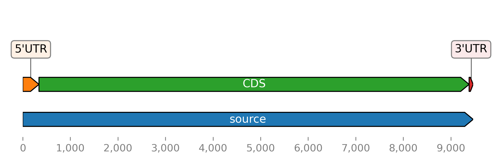

Plotting alignments
===================

Alignments can be plotted using the `.BioBasket.plot_alignment()` method.
Some code examples follow:

.. These figures are generated manually with the test suite

>>> from sugar import read
>>> seqs = read('https://osf.io/download/j2wyv')
>>> seqs.plot_alignment(show=True, figsize=(10, 4))

>>> seqs[:, 70:120].plot_alignment(fname='ali.pdf', color=None, figsize=(10,8),
...                                symbols=True, aspect=2, alpha=0.5)

.. image:: ../_static/ali2.png
    :width: 40%

The following example shows an alignment of amino acids
using the ``'flower'`` color scheme, a color scheme that
displays amino acids with a high BLOSSUM62 score in similar colors.
Color schemes originate from Biotite (Gecos), Jalview and ClustalX,
see `here`_ for an overview.
The available color schemes are listed in `.get_color_scheme()`.

>>> seqs2 = seqs[:5, :150].copy()
>>> seqs2.translate(complete=True).plot_alignment(
...     show=True, color='flower', figsize=(10,8),  symbols=True,
...     aspect=2, alpha=0.5, edgecolors='w')

The plotting function has many options,
including marking of plotting feature regions with different colors.
Multi-line plots are not supported.
If you need these, consider converting the sequences to a biotite ``Alignment`` object via
`seqs.tobiotite(msa=True) <.BioBasket.tobiotite>`
and using
`Biotite's plotting capabilities <https://www.biotite-python.org/latest/examples/gallery/sequence>`_.

.. _here: https://www.biotite-python.org/latest/examples/gallery/sequence/misc/color_schemes_protein.html

Plotting features
-----------------

Sugar can plot features with DNAFeaturesViewer_.
Use the ``plot_ftsviewer()`` method of
`FeatureList <.FeatureList.plot_ftsviewer>`,
`BioBasket <.BioBasket.plot_ftsviewer>`, or
`BioSeq <.BioSeq.plot_ftsviewer>`.

Plot the features of the example sequence:

.. These figures are generated manually with the test suite

>>> from sugar import read
>>> seqs = read()
>>> seqs.plot_ftsviewer(show=True)

Another example plotting the CDS features of an Ebolavirus RNA:

>>> from sugar.web import Entrez
>>> client = Entrez()
>>> seq = client.get_seq('AF086833')
>>> fts = seq.fts.select('cds')
>>> for ft in fts:
...    ft.meta.name = ft.meta._genbank.gene
>>> fts.plot_ftsviewer(colorby='name', seqlen=len(seq), figsize=(6, 2.5), show=True)

For comparison we plot all open reading frames longer than 500 nucleotides:

>>> orfs = seq.find_orfs().select(len_gt=500)
>>> orfs.plot_ftsviewer(colorby='rf', label=None, seqlen=len(seq), figsize=(6, 2.5), show=True)

If you want more fine-grained control you can convert features to
a `~dna_features_viewer.GraphicRecord` object with the
`~.FeatureList.toftsviewer()` method and use the
`plotting <dna_features_viewer.GraphicRecord.plot>` method of the returned object:

>>> seqs = read()
>>> record = seqs[1].toftsviewer()
>>> record.plot()

.. note::
    Using `BioSeq <.BioSeq.plot_ftsviewer>` or `.BioBasket.plot_ftsviewer()`
    over `.FeatureList.plot_ftsviewer()` has the advantage,
    that sequence lengths are used automatically.